# Ejercicios con UserDir, WebDav y Rewrite

1.- Crea dos usuarios nuevos en tu sistema Ubuntu y llámalos "daw1(tus iniciales del nombre)" y "daw2(tus iniciales del nombre)". Habilita y configura el módulo UserDir de forma que el usuario daw1 pueda acceder a su carpeta pública pero no así el usuario daw2.

Primero creamos los dos usuarios: crddaw1 y crddaw2.

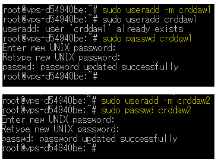

Ahora procedemos a crear sus respectivos index.html en su fichero public_html.

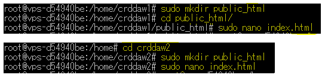

Ahora procedemos a editar el módulo UserDir y procedemos a deshabilitar al usuario crddaw2 tal y como nos pide el ejercicio.

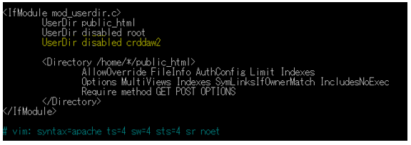

Y ahora hacemos las comprobaciones correspondientes, no sin antes activar el módulo userdir con el comando a2enmod userdir.

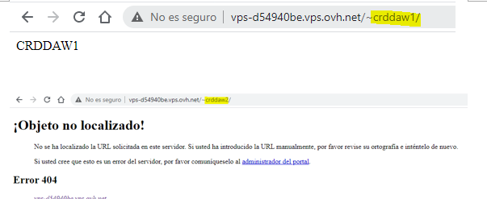

2.- Habilita el módulo WebDav y configúralo mediante autenticación "Digest" de forma que puedas utilizar un servidor WebDav en tu apache con el explorador de archivos de tu sistema como cliente.

Primero de nada, activamos el módulo webdav con el comando a2enmod dav dav_fs. Luego crearemos una carpeta en la cual se guardará todos los ficheros de webdav y le asignaremos como propietario al usuario de apache2.

Por último, crear la siguiente directiva en el archivo de configuración de nuestro virtualhost y crearemos un alias de igual modo para vincularlo con la carpeta webdav que creamos en el paso anterior.

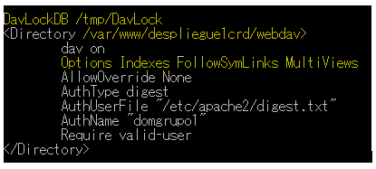

Ahora hacemos las comprobaciones necesarias:

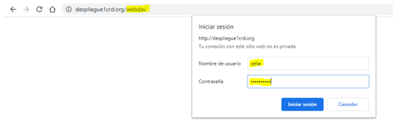

3.- Haz uso de la directiva RewriteCond definiendo una regla de escritura poder servir un mismo recurso con una URL antigua porque te interesa que tus clientes sigan accediendo como accedían antiguamente a ese recurso (suponemos que se ha reestructurado nuestro sitio web y se ha cambiado la URL por la necesidad que sea a un fichero diferente dentro del "documentroot")

Primero de nada, activamos el módulo rewritecond con el comando a2enmod rewrite. Ahora procedemos a crear el indexNuevo y el indexAntiguo para ser redireccionado respectivamente:

Ahora en nuestro archivo .htaccess añadiremos los siguientes parámetros:

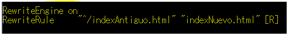

Ahora comprobamos si la redirección se lleva a cabo de manera efectiva:

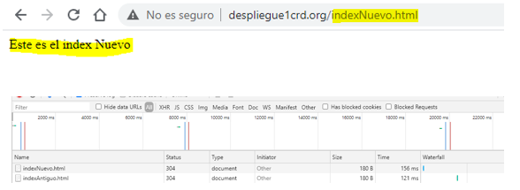

4.- Instala la aplicación AWStats en tu apache para que muestre las estadísticas de acceso al virtual host que tu quieras.

Instalaremos AWStats con el siguiente comando: 

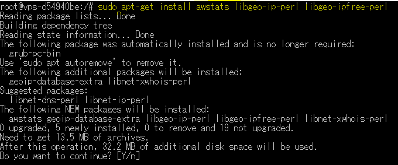

Y realizaremos los siguientes cambios en su configuración:

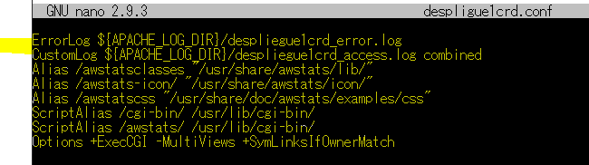

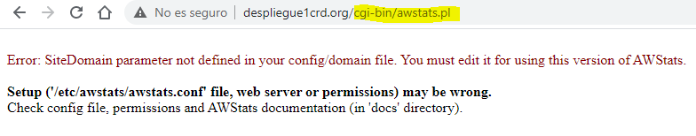

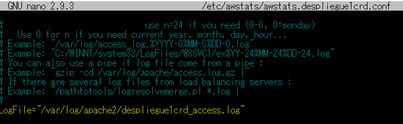

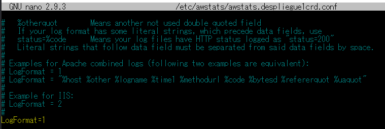

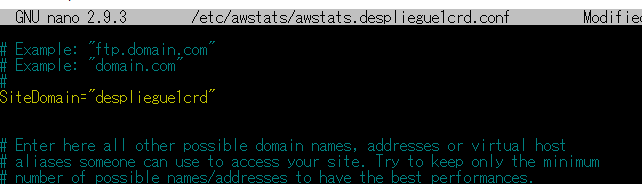

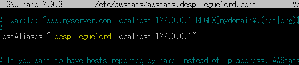

